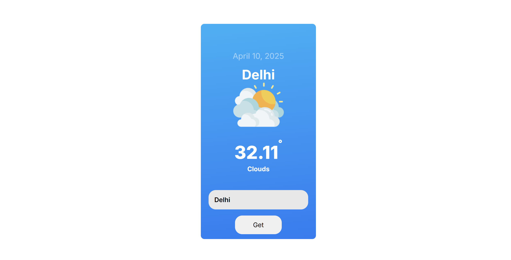

# 🌤️ Weather App

A simple and responsive weather application built using **React.js**. It fetches real-time weather data using the **OpenWeatherMap API** and displays current temperature, weather conditions, and more.

## 🔍 Features

- 🌦️ Current weather by city.
- 📍 Weather by user’s location (Geolocation API).
- 📈 Weather details like humidity, pressure, and wind speed.
- 🎨 Clean and responsive UI.

## 🧰 Tech Stack

- React.js
- CSS
- OpenWeatherMap API

### 🖼️ Home Page



## 🚀 Getting Started

### Prerequisites

- Node.js (v14 or higher)
- npm or yarn

### Installation

1. Clone the repository:

```bash
git clone https://github.com/shelavalepallavi/weather-app.git
cd weather-app
```
Install dependencies:
```
npm install
# or
yarn
```
Get your free API key from OpenWeatherMap

Create a .env file in the root directory and add:
```
  REACT_APP_WEATHER_API_KEY=your_api_key_here
```
Run the app
```
npm start
# or
yarn start
```
🛠️ Project Structure
```
weather-app/
│
├── public/
├── src/
│   ├── index.js
│   ├── App.css     
│   ├── App.js
│   └── index.css
├── .env
├── package.json
└── README.md
```
🧪 Future Improvements
🔍 Search autocomplete

🌎 7-day forecast

🌙 Dark mode

🗺️ Map integration


🙌 Acknowledgements
OpenWeatherMap

React.js

GeoLocation API
